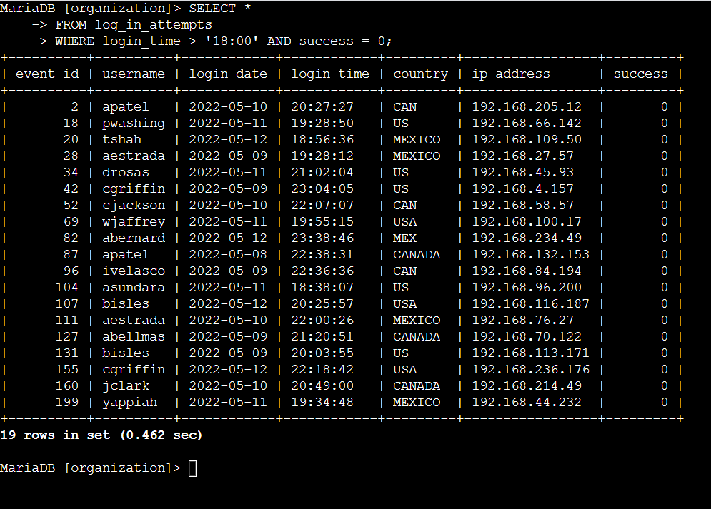

# Filtering SQL Queries
 In this project, I will use diverse SQL filtering opertors.

 In the cybersecurity course, I learned how to filter queries using diverse operator, such as queries containing the `AND`, `OR`, and `NOT` operators.<br>
 In this project, I'll continue to to explore how these operators can help me refine my queries.


~~~ 
Scenario
 
You are a security professional at a large organization. Part of your job is to investigate security issues to help keep the system secure. You recently discovered some potential security issues that involve login attempts and employee machines.

Your task is to examine the organization’s data in their employees and log_in_attempts tables. You’ll need to use SQL filters to retrieve records from different datasets and investigate the potential security issues.

~~~


## Retrieve after hours failed login attempts


**Scenario**<br>
You recently discovered a potential security incident that occurred after business hours. Query the `log_in_attempts` table and review after hours login activity. Use filters in SQL to create a query that identifies all failed login attempts that occurred after `18:00`. (The time of the login attempt is found in the `login_time` column. The `success` column contains a value of `0` when a login attempt failed; you can use either a value of `0` or `FALSE` in your query to identify failed login attempts.)


To query for `log_in_attempts` I need to run `SELECT * FROM log_in_attempts` to select all information in the `log_in_attempts` column followed by `where` clause, then input the what I want to filter for, in this case I have to filter for `login_time` and `success`.

The code would be:
```sql
SELECT *
FROM log_in_attempts
WHERE login_time > '18:00' AND success = 1;
```



## Retrieve login attempts on specific dates


```nocode
Scenario

A suspicious event occurred on 2022-05-09. To investigate this event, you want to review all 
login attempts which occurred on this day and the day before. Use filters in SQL to create a 
query that identifies all login attempts that occurred on 2022-05-09 or 2022-05-08. (The date 
of the login attempt is found in the login_date column.)
```

## Retrieve login attempts outside of Mexico
**Scenario**<br>
There’s been suspicious activity with login attempts, but the team has determined that this activity didn't originate in Mexico. Now, you need to investigate login attempts that occurred outside of Mexico. Use filters in SQL to create a query that identifies all login attempts that occurred outside of Mexico. (When referring to `Mexico`, the `country` column contains values of both `MEX` and `MEXICO`, and you need to use the `LIKE` keyword with `%` to make sure your query reflects this.)

## Retrieve employees in Marketing
**Scenario**<br>
Your team wants to perform security updates on specific employee machines in the Marketing department. You’re responsible for getting information on these employee machines and will need to query the `employees` table. Use filters in SQL to create a query that identifies all employees in the Marketing department for all offices in the East building.

(The department of the employee is found in the `department` column, which contains values that include `Marketing`. The office is found in the office column. Some examples of values in this column are `East-170`, `East-320`, and `North-434`. You’ll need to use the `LIKE` keyword with `%` to filter for the East building.)

## Retrieve employees in Finance or Sales
**Scenario**<br>
Your team now needs to perform a different security update on machines for employees in the Sales and Finance departments. Use filters in SQL to create a query that identifies all employees in the Sales or Finance departments. (The department of the employee is found in the `department` column, which contains values that include `Sales` and `Finance`.)

## Retrieve all employees not in IT
**Scenario**<br>
Your team needs to make one more update to employee machines. The employees who are in the Information Technology department already had this update, but employees in all other departments need it. Use filters in SQL to create a query which identifies all employees not in the IT department. (The department of the employee is found in the `department` column, which contains values that include `Information Technology`.)

## Summary

test